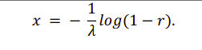
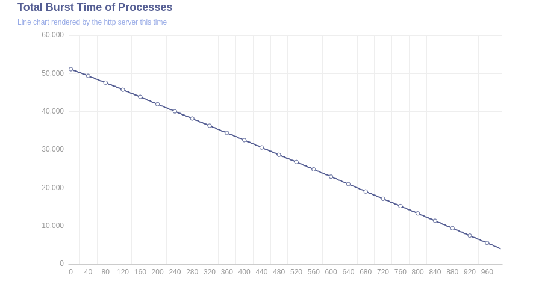
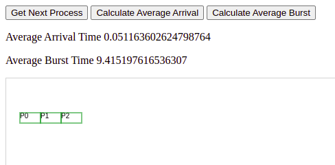

# ISTANBUL TICARET UNIVERSITY

## OPERATING SYSTEM - CPU SCHEDULING PROJECT 


* *Name:* Yunus AYDIN 

* *Email:* [aydinnyunus@gmail.com](mailto:aydinnyunus@gmail.com)

* *GitHub:* [https://github.com/aydinnyunus](https://github.com/aydinnyunus)


# 2. Project Information

## 2.1. Project summary

**Stochastic Modeling of CPU Scheduling using Round Robin**

The aim of the project is to schedule CPU Process with stochastic variables. There are 3 queues and their priority is changable according to their availability and these queues work by Round Robin algorithm. Burst Time and Exit Time generated using Exponential Distribution and Arrival Time is generated using Poisson Distribution. Average Waiting Time, Turnaround Time, Exit Time is calculated in every cycle and showed on the Simulation.


## 2.2. Project description and timeline

### Phase 1: Generating Random Numbers using Poisson and Exponential Distribution

1. Found the formula that needed on [Computer Simulation Techniques:The definitive introduction](https://people.engr.ncsu.edu/hp/files/Simulation.pdf) and I use the formula for generating Random Numbers using Exponential Distribution and [Poisson Distribution](http://www.aip.de/groups/soe/local/numres/bookcpdf/c7-3.pdf)



2. Creating Functions
- Rand function returns a random sample drawn from the distribution. I got the formula from NUMERICAL RECIPES IN C: THE ART OF SCIENTIFIC COMPUTING (ISBN 0-521-43108-5) p. 294 <http://www.aip.de/groups/soe/local/numres/bookcpdf/c7-3.pdf>

&nbsp;
&nbsp;
&nbsp;
&nbsp;
&nbsp;

**Code Example**
```
func (p Poisson) Rand() float64 {
	

	rnd := rand.ExpFloat64
	var rng *rand.Rand
	if p.Src != nil {
		rng = rand.New(p.Src)
		rnd = rng.ExpFloat64
	}

	if p.Lambda < 10.0 {
		// Use direct method.
		var em float64
		t := 0.0
		for {
			t += rnd()
			if t >= p.Lambda {
				break
			}
			em++
		}
		return em
	}

	// Algorithm PTRS
	rnd = rand.Float64
	if rng != nil {
		rnd = rng.Float64
	}
	b := 0.931 + 2.53*math.Sqrt(p.Lambda)
	a := -0.059 + 0.02483*b
	invalpha := 1.1239 + 1.1328/(b-3.4)
	vr := 0.9277 - 3.6224/(b-2)
	for {
		U := rnd() - 0.5
		V := rnd()
		us := 0.5 - math.Abs(U)
		k := math.Floor((2*a/us+b)*U + p.Lambda + 0.43)
		if us >= 0.07 && V <= vr {
			return k
		}
		if k <= 0 || (us < 0.013 && V > us) {
			continue
		}
		lg, _ := math.Lgamma(k + 1)
		if math.Log(V*invalpha/(a/(us*us)+b)) <= k*math.Log(p.Lambda)-p.Lambda-lg {
			return k
		}
	}
}

```

### Phase 2: Implementing Round Robin Algorithm

Round Robin is a CPU scheduling algorithm where each process is assigned a fixed time slot in a cyclic way. 

1. I set time quantum value for 5 because generated random number range is 0 to 10 and I decided to set quantum value average of random numbers. 
2. I calculate the Total Burst Time and Remaining Time. After that I extract the calculated values from Total Burst Time and Remaining Time and if Remaining Time of the process is 0 then that process is calculated so pass that process. 
3. Lastly, calculate the Turn Around Time, Exit Time and Wait Time of each processes.

```
func roundRobin() {
	timeQuantum := float64(5)
	totalTime = calculateTotalTime()
	remainingTime = calculateRemaining()
	values = append(values, opts.LineData{Value: values})
	fmt.Println("Total Time ", totalTime)
	for math.Round(totalTime*10000) / 10000 != 0{
		for i := range processList {
			if processList[i].remainingTime <= timeQuantum && processList[i].remainingTime > 0{
				totalTimeCounted += processList[i].remainingTime
				totalTime -= processList[i].remainingTime

				processList[i].remainingTime = 0
				values = append(values, opts.LineData{Value: values})

			} else if processList[i].remainingTime > 0 {

				processList[i].remainingTime -= timeQuantum
				totalTime -= timeQuantum
				totalTimeCounted += timeQuantum
				values = append(values, opts.LineData{Value: values})

			}
			if processList[i].remainingTime == 0 && !processList[i].isCalculated {
				processList[i].waitTime = totalTimeCounted - processList[i].arrivalTime - processList[i].actualBurstTime
				waitTime += processList[i].waitTime

				processList[i].turnAroundTime = totalTimeCounted - processList[i].arrivalTime
				turnaroundTime += processList[i].turnAroundTime

				processList[i].exitTime = processList[i].arrivalTime + processList[i].turnAroundTime
				processList[i].isCalculated = true
			}
		}
	}
}

```


### Phase 3: Implement Queue Modeling and Random Processes

1. I created structs for Queues and Processes. Queues contains id of the queue, maximum length, priority and available length.
2. I created Catch method to check if queue is available for catching process
3. I created Release method to when process is done release that process from the queue
4. Run Method is generate random numbers according to Exponential Distribution and always use the highest priority queue to add to queue.
```
type Queues struct {
	id int
	max int
	priority int
	availableQueues int
}

func (queues *Queues) Catch(customer *Process) {
	for {
		counterSwt.Wait(true)
		if processArrivalQueue.GetHead().(*Process).id == customer.id {
			break
		} else {
			godes.Yield()

		}
	}

	queues.availableQueues++
	if queues.availableQueues == queues.max {
		counterSwt.Set(false)
	}
}

func (queues *Queues) Release() {
	queues.availableQueues--
	counterSwt.Set(true)
}

// Process the Process is a Runner
type Process struct {
	*godes.Runner
	id                                                                                                                                                     int
	exitTime, actualBurstTime, estimatedBurstTime, arrivalTime, remainingTime, serviceTime, waitTime, turnAroundTime, avgArrivalTime, avgWaitTime, avgTurnAroundTime float64
	isCalculated																   bool
}

func (process *Process) Run() {
	s1 := rand.NewSource(time.Now().UnixNano())
	r1 := rand.New(s1)
	no := service.Get(1. / r1.Float64())
	process.serviceTime = no
	a0 := godes.GetSystemTime()
	min := queueList[0]
	max := queueList[0]
	setPriorities()
	for _, value := range queueList {
		if 	value.priority< min.priority {
			min = value
		}
		if value.priority > max.priority {
			max = value
		}
	}
	max.Catch(process)
	a1 := godes.GetSystemTime()
	processArrivalQueue.Get()
	qlength := float64(processArrivalQueue.Len())
	godes.Advance(no)
	a2 := godes.GetSystemTime()
	max.Release()
	collectionArray := []float64{a2 - a0, qlength, a1 - a0, a2 - a1}
	measures = append(measures, collectionArray)
	fmt.Printf("Estimated Burst Time %f", process.estimatedBurstTime)
	fmt.Println()
	fmt.Printf("Arrival Time %f", process.arrivalTime)
	fmt.Println()

}

```


### Phase 4: Simulation on HTTP Server

1. Create some graphs for visualize data



2. Create simulation for getting next process and calculate average burst time and arrival time and visualize queue.



&nbsp;

I use HTML template for transfering data to Golang to JavaScript. I transfered the Process Burst Time and Arrival Time array and when User Clicks the "Get Next Process" button, It gets the process from the Array. If User clicks the "Calculate Average Burst Time", burst time is calculated according to visualized queue.

```
func httpserver(w http.ResponseWriter, _ *http.Request) {
	// create a new line instance
	line := charts.NewLine()
	for i:=0;i<5;i+=1000{
		items = append(items,values[i])
	}
	// set some global options like Title/Legend/ToolTip or anything else
	line.SetGlobalOptions(
		charts.WithInitializationOpts(opts.Initialization{Theme: types.ThemeWesteros}),
		charts.WithTitleOpts(opts.Title{
			Title:    "Total Burst Time of Processes",
			Subtitle: "Line chart rendered by the http server this time",
		}))

	// Put data into instance
	line.SetXAxis([]string{"0", "100", "200", "300", "400", "500", "600"}).
		AddSeries("Category A", generateLineItems()).
		SetSeriesOptions(charts.WithLineChartOpts(opts.LineChart{Smooth: true}))
	line.Render(w)
}

```


## 2.3. Additional notes

The Reason I use Go Programming Language is because I want to develop myself on Golang and understanding more complex systems and basics.
